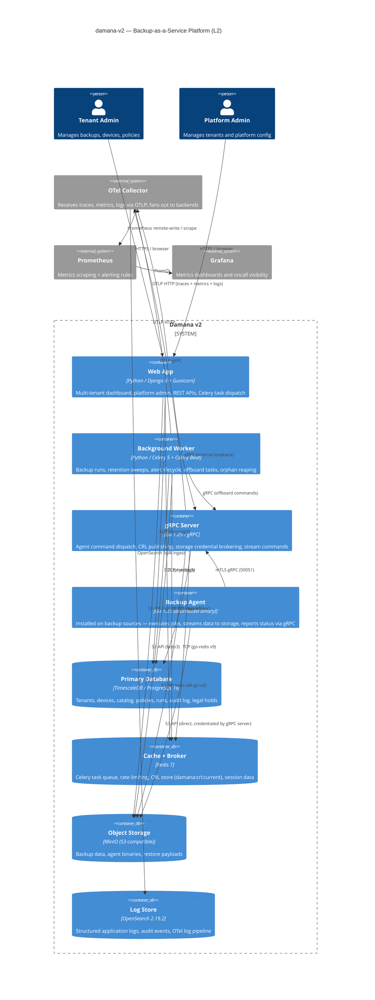

# damana-v2 — C4 Container Diagram (L2)

> **Note**: this diagram was auto-generated by /handover on 2026-05-27 from repo signals (docker-compose.yml, requirements.txt, go.mod, .env.example, README.md). It is a **starting point** — review and refine.
>
> - Container labels and tech strings — the detector inferred these from compose service images and package deps; verify against the actual deployment
> - Inferred relationships — data flows are approximate; gRPC and REST boundaries in particular should be confirmed
> - External systems — anything your team uses that isn't in package.json / go.mod (e.g. infra-only dependencies, direct cloud APIs) won't have been detected
>
> Update the "Maintenance" section below once the diagram is stable.

## Maintenance

(From the template — update when L2 containers change.)

---

